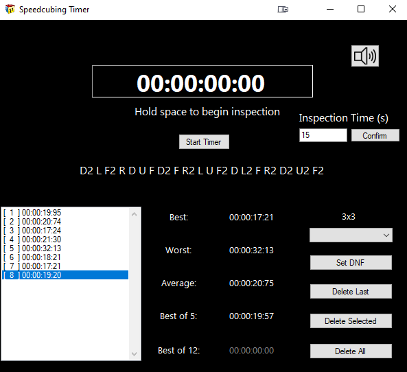

# Speedcubing Timer - SpcTimer
A simple speedcubing timer, supports saving and deleting scores, different cube types, keyboard control, audio cues, inspection timer.

## Table of contents
* [Screenshots](#screenshots)
* [Technologies](#technologies)
* [Installation](#installation)
* [Setup](#setup)
* [Features](#features)
* [Status](#status)
* [Inspiration](#inspiration)

## Screenshots

## Technologies
* C# with .Net Framework (4.7.2)
* Winforms designed in Visual Studio 19
* XUnit for unit tests
* GIT for source contol

## Installation
Working version in Releases - just extract .zip to a folder and run SpcTimer.exe. 
Solves will automatically save to Solves.csv. You can also change audio files or delete them if they annoy you.

## Setup
To run code just open .sln file with Visual Studio. Beware, the project uses MVC - main Dashboard form communicates with Controller class via interface.

## Features
List of features ready and TODOs for future development
* Graphical UI with colors changing based on current application state
* Timer with keyboard/button control
* Inspection Timer + DNF option for user
* Sound urging user to start solving, signaling begin/end of solve
* Scramble generating algorithms for 2x2, 3x3, 4x4 cubes
* Past solves database
* Statistics calculator (Best, Worst, Average, Bo5, Bo12)
* Different cube types (2x2, 3x3, 4x4)

To-do list:
* Scrambled cube visualizer (altough that will probably need a lot of code to work properly)
* Statistics plotting (some time/solves graphs...)
* Better resizing (currently panels don't resize when growing a form, shrinking works correctly)
* More user changed stuff (for example background color picker)
* SQL database connection?
* Split every application launch into solving sessions?

## Status
Project is: _currently stopped_, altough i may add something from time to time 

## Inspiration
https://github.com/ritaly/README-cheatsheet - README template
https://www.youtube.com/watch?v=wfWxdh-_k_4 - party inspired by